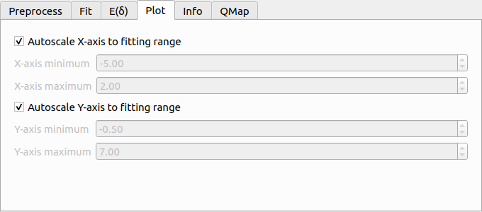
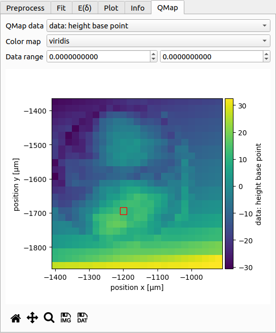
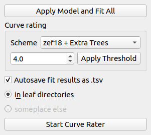

==============
User Interface
==============

Overview
========
When you first start PyJibe, you will be greeted with an empty user interface.
To open experimental data, choose one of the corresponding options in the
*File* menu. 

Force-Distance Analysis
=======================
Force-distance (FD) measurements consist of an approach and a retract curve.
The point of maximum indentation is usually defined by the acquisition
software as a *setpoint* using an active feedback loop.

The screenshot shows a typical data analysis in PyJibe. A *.jpk-force-map*
file has been loaded. The plot at the top shows the experimental FD curve
(approach light blue, retract light red), the model fit (dark blue), and the
fitting region (white region, bounded by gray background in the upper plot).
Below are the fit residuals. On the right
are the main controls (discussed in the sections below). At the bottom
is the curve list, highlighting which curve is currently shown at the top.
At the bottom right are the :ref:`curve list controls <sec_ui_fd_curvelist>`.

.. note::
    Notice how the fit residuals become small around the contact point?
    PyJibe comes with the feature *Suppress residuals near contact point*
    (in the fit tab on the right). This option suppresses the contributions
    of the FD curve near the contact point.
    This feature was designed for biological samples, where the physical
    tip-sample interactions near the "contact point" are not well-understood
    :cite:`Mueller19nanite`. The contributions near the contact point are
    suppressed to give the remainder of the indentation curve more weight.
    

The dataset shown resembles a 2D scan of AFM force-distance curves from a
live zebrafish spinal cord microtome section and is available on figshare
:cite:`qmap20` (same data as in :cite:`Moellmert2020` fig. 1e
and :cite:`Mueller19nanite` fig. 3a,d,g).

Tab: Preprocess
---------------
.. image:: scrots/ui_fd_tab_preproc.png
    :target: _images/ui_fd_tab_preproc.png
    :align: right
    :scale: 65%

Before starting to fit FD data, it is important to perform the correct
preprocessing steps. Usually, this includes computing the tip position
and correcting for a force and tip position offset.

The preprocessing pipeline is defined via the checkable options in this
tab. If you hover over the options, a tool tip is displayed with an
explanation. If your analysis pipeline strongly depends on a good
estimate of the contact point, then you have multiple options which are
described in detail in the :ref:`nanite docs<nanite:sec_fitting_preproc>`.

.. _sec_ui_fd_tab_fit:

Tab: Fit
--------
.. image:: scrots/ui_fd_tab_fit.png
    :target: _images/ui_fd_tab_fit.png
    :align: right
    :scale: 65%

PyJibe offers a variety of options for fitting FD data. In the upper part,
you may select the segment (approach or retract), the axes, the fit model,
and the fitting range.

Range:
    The fitting range can be set to absolute (relative to
    the X axis after preprocessing) or relative to the contact point. In the
    latter case, the fit is repeated four times, updating the new contact
    point at each iteration.
    You have three option for setting the indentation depth (left part
    of the fit interval):
    
    1. globally: For each FD curve, the same indentation depth is used
       (after preprocessing has been applied).
    2. individually: You select the indentation depth for each FD curve
       separately.
    3. guess optimal indentation depth: The optimal indentation depth
       is guessed using the :ref:`E(δ)-curve <sec_ui_fd_tab_edelta>`.  

Suppress residuals near contact point:
    This option multiplies the residuals with a linear ramp, left and right
    of the contact point. The ramp has a value of 0 at the contact point
    and a value of 1 at the distance defined by the controls. All other
    residuals or not changed.
    This feature was designed for biological samples, where the physical
    tip-sample interactions near the "contact point" are not well-understood
    :cite:`Mueller19nanite`. The contributions near the contact point are
    suppressed to give the remainder of the indentation curve more weight.

Ancillary Parameters:
    Ancillary parameters (not shown in the screenshot here), are parameters
    that are defined in the fitting model. They are computed prior to the
    fit and can be set as fitting parameters. Standard models usually do
    not have ancillary parameters.

Initial Parameters:
    These are the parameters set initially during fitting. In the table, you
    may choose which parameters should remain fixed during fitting, what
    the initial values should be, and in which interval this value may be
    varied. 

Results:
    The fit results of the varied parameters are shown here.

.. _sec_ui_fd_tab_edelta:

Tab: E(δ)
---------
.. image:: scrots/ui_fd_tab_edelta.png
    :target: _images/ui_fd_tab_edelta.png
    :align: right
    :scale: 65%

The E(δ) curve is used to test whether the fitted Young's modulus E is
dependent on the fitting interval. For a reliable fit, the E(δ) curve should
exhibit a plateau. This is the case for the present example, where the fitted
value of E does not vary much in the range from δ=-2.5µm to δ=-4.8µm (maximum
indentation).

The control at the top is identical to the control in the :ref:`fitting tab
<sec_ui_fd_tab_fit>`. You may choose the number of samples of the E(δ).
The controls for setting the indentation depth manually are enabled when
you select *set indentation depth individually* in the dropdown menu.
Below the plot you have the options to export the E(δ) curve as an image
or as a data file (.tsv). If you would like to export all E(δ) curves of
the dataset, you can do so via the *Export* menu of the main window.

.. _sec_ui_fd_tab_plot:

Tab: Plot
---------

The plotting tab allows you to modify the plot settings. By default, the plot
is adapted to the fitting interval. You may, however, modify the axes ranges
manually by unchecking the check boxes. 

.. _sec_ui_fd_tab_info:

Tab: Info
---------

The info tab shows metadata related to the currently shown curve.
Unknown values are indicated as *nan*.

Acquisition:
    Settings of the acquisition software

Ancillaries:
    Ancillary parameters are computed for each model. Here, the
    *maximum indentation* is listed, which is the difference between
    the fitted contact point and the value of the tip position where
    the fitted curve has its maximum. Fit models may have their own
    specific ancillary parameters.

Dataset:
    Measurement parameters of the dataset

QMap:
    If the curve is part of a quantiative map (2D FD scan), then
    the scan grid properties and the curve position are listed.

Setup:
    Information about the AFM setup used

Storage:
    Information about the data file, which are not particularly important
    for the experiment, but allow to identify a dataset or curve

.. _sec_ui_fd_tab_qmap:

Tab: QMap
---------

If the dataset consists of a quantitative map, then this map is shown
here. It serves as an interactive overview of the dataset.
You can choose which data to plot (e.g. piezo height, fitted parameters,
curve rating, scan order), which colormap to use, and how the colormap should
be scaled. The coordinate axes are identical to those shown in the info tab.

The red square in the plot indicates which curve is currently shown. You may
click on the plot to select curves manually (as opposed to using the
curve list at the bottom of the window).

Below the plot are controls for exporting the qmap as an image or as a text
file.

.. _sec_ui_fd_curvelist:

Curve list controls
-------------------

The curve list controls perform operations on the entire FD curve list.
The *Apply Model and Fit All* button does exactly what it says.

Curve rating allows you to rate each indentation curve. This is useful
e.g. when you would like to sort out bad curves automatically. In this example,
all curves with a rating below a threshold of 4.5 are excluded from further
analysis using the *zef18 + Extra Trees* rating scheme :cite:`Mueller19nanite`.

Below the curve rating options, you may enable or disable autosaving of the
fit results. Only the results for curves that are selected as "use" in the
curve list are exported.

For more information on rating, please have a look at the :ref:`nanite
documentation <nanite:sec_rating>`.
The button at the bottom starts the PyJibe curve rater which is compatible
to the nanite rating workflow. If you would like to import your own training
set, please read the quick guide :ref:`sec_qg_import_ts`.

Tools
=====

Data conversion
---------------
Under *Tools | Convert AFM data...*, you can select raw AFM data files and
convert them to the CSV or HDF5 file formats. PyJibe uses the :ref:`afmformats
<afmformats:index>` library to load and save AFM data.

Advanced options
================

Extensions
----------
Under *Edit | Preferences | Extensions*, you may import your own custom
fit models. See :ref:`sec_qg_extensions` for more information.

Expert and Developer mode
-------------------------

Under *Edit | Preferences | Advanced*, you can enable expert and developer
mode.

- Expert mode:

  - Enables you to manually set the minimizer method and the corresponding
    keyword arguments applied by lmfit.

- Developer mode:

  - Everything that is available in expert mode.
  - Allows you to open experimental data that were not recorded via
    force-distance modality (e.g. creep-compliance). Related issues are
    `nanite #11 <https://github.com/AFM-analysis/nanite/issues/11>`_ and
    `afmformats #15 <https://github.com/AFM-analysis/afmformats/issues/15>`_.
  - Slows down loading of large datasets (because the modality has to be
    determined first).
  - Displays and exports hidden model parameters (parameters whose name
    starts with an underscore ``_``).
