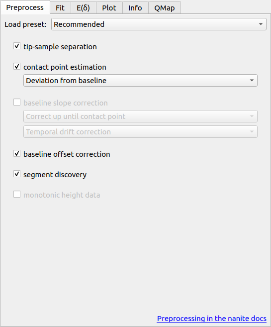
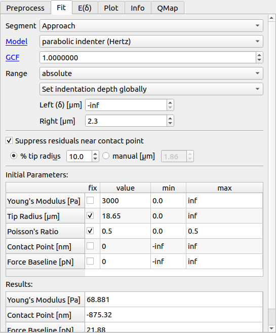

==============
User Interface
==============

Overview
========
When you first start PyJibe, you will be greeted with an empty user interface.
To open experimental data, choose one of the corresponding options in the
*File* menu. 

Force-Distance Analysis
=======================
Force-distance (FD) measurements consist of an approach and a retract curve.
The point of maximum indentation is usually defined by the acquisition
software as a *setpoint* using an active feedback loop.

.. image:: scrots/ui_fd_main.png
    :target: _images/ui_fd_main.png
    :align: right
    :scale: 20%

The screenshot shows a typical data analysis in PyJibe. A *.jpk-force-map*
file has been loaded. The plot at the top shows the experimental FD curve
(approach light blue, retract light red), the model fit (dark blue), and the
fitting region (shaded yellow). Below are the fit residuals. On the right
are the main controls (discussed in more detail further below). At the bottom
is the curve list, highlighting which curve is currently shown at the top.
At the bottom right are the curve list controls (explained below).

.. note::
    Notice how the fit residuals become small around the contact point?
    PyJibe comes with the feature *Suppress residuals near contact point*
    (in the fit tab on the right). This option suppresses the contributions
    of the FD curve near the contact point.
    This feature was designed for biological samples, where the physical
    tip-sample interactions near the "contact point" are not well-understood
    :cite:`Mueller19nanite`. The contributions near the contact point are
    suppressed to give the remainder of the indentation curve more weight.
    

The data shown resemble a 2D scan of AFM force-distance curves from a
live zebrafish spinal cord microtome section (same data as in
:cite:`Moellmert2020` fig. 1e and :cite:`Mueller19nanite` fig. 3a-c).

Curve list controls
-------------------
.. image:: scrots/ui_fd_curve_controls.png
    :target: _images/ui_fd_curve_controls.png
    :align: right
    :scale: 65%

Tab: Preprocess
---------------

Tab: Fit
--------

Tab: E(δ)
---------

Tab: Plot
---------
.. image:: scrots/ui_fd_tab_plot.png
    :target: _images/ui_fd_tab_plot.png
    :align: right
    :scale: 65%

Tab: Info
---------
.. image:: scrots/ui_fd_tab_info.png
    :target: _images/ui_fd_tab_info.png
    :align: right
    :scale: 65%

Tab: QMap
---------
.. image:: scrots/ui_fd_tab_qmap.png
    :target: _images/ui_fd_tab_qmap.png
    :align: right
    :scale: 65%
