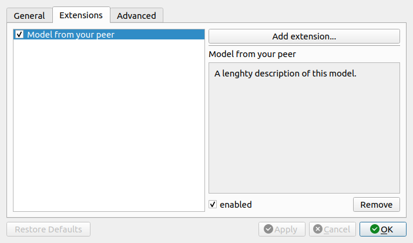

.. _sec_qg_extensions:

======================================
Loading Extensions (nanite fit models)
======================================
Since version 0.12.0, PyJibe allows loading nanite
:ref:`fit models <nanite:sec_dev_model>`.

You may need this feature if you are developing fit models yourself or if
you received a fit model from your peer.

.. note::
    If you installed PyJibe via installer (not via `pip`), then
    many extensions might not work due to software dependencies that
    those extensions might have. If this happens, please create an
    issue in the PyJibe repository so we can find a solution.

.. warning::
    Extensions can be harmful. Please only load extensions that you
    received first-hand from people you trust.

You can load and manage extensions via the *Edit | Preferences* dialog in the
*Extensions* tab.

