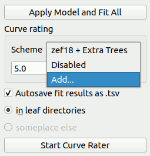

.. _sec_qg_import_ts:

=====================================
Importing a pre-computed training set
=====================================

A training set is a set of text files containing rating features
and manual user ratings. Training sets are the basis of the rating
scheme employed in PyJibe (and nanite) :cite:`Mueller19nanite`. By default,
PyJibe comes with the *zef18* training set :cite:`zef18`. For general information
about how manual rating and generation of the training set works, please
refer to the :ref:`nanite rating workflow <nanite:sec_rating>`.

In order to import a training set into PyJibe,
the text files (``train_feat_*.txt`` and ``train_response.txt``) must be
zipped and named according to the scheme
``ts_NAME.zip``, where ``NAME`` is a descriptive name. 

The import in PyJibe is carried out by selecting *Add...* in the
*Scheme* dropdown menu, located in the *Curve rating* box
(lower right of a Force-Distance analysis).
A dialog will ask for the zipped training set (e.g. ``ts_organoids19.zip``). 

The import is persistent, i.e. the training set is extracted to the
user's configuration directory and thus does not have to be imported
again the next time PyJibe is run. 

