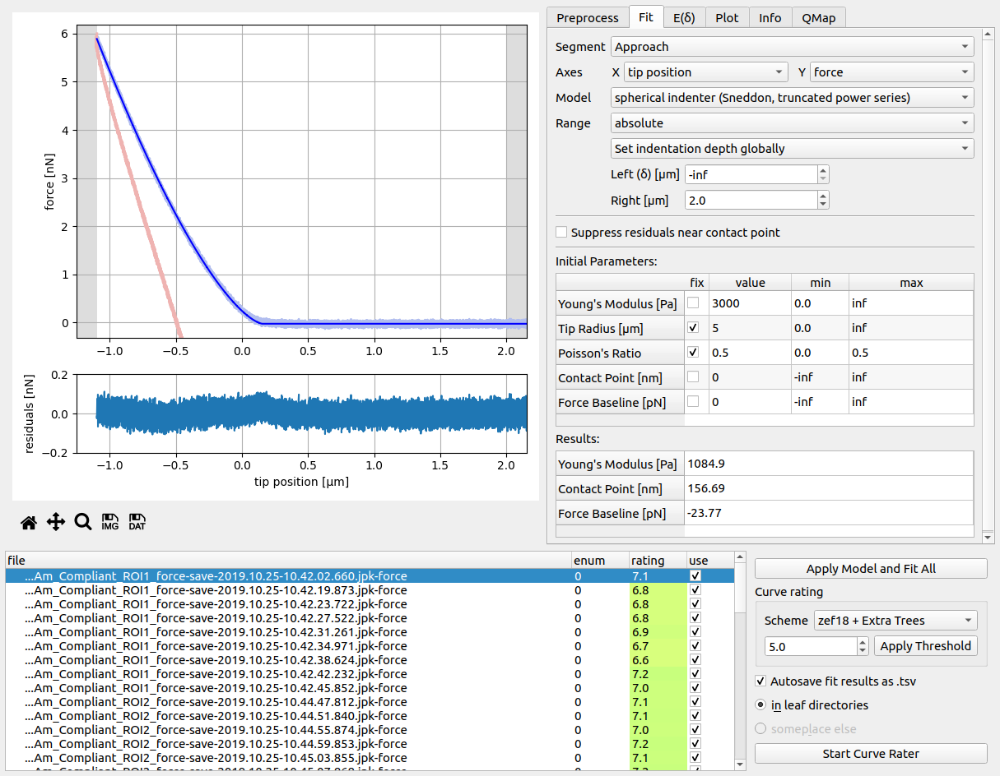
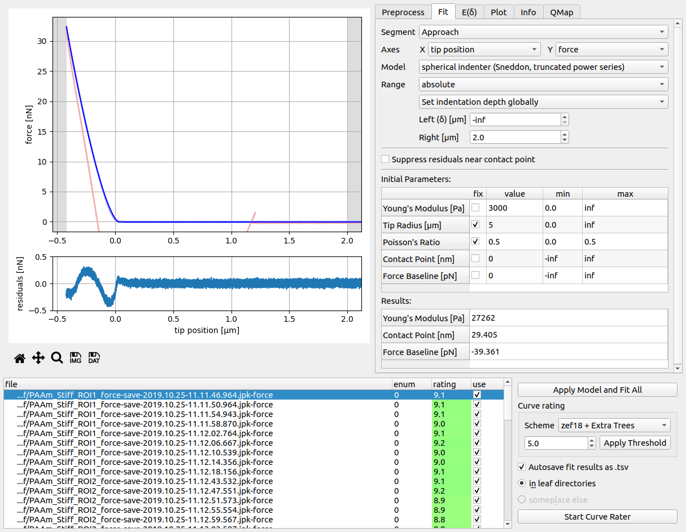

.. _tutorial01:

===================================
T1: Stiffness of two PAAm hydrogels
===================================

Introduction
------------
In this tutorial, you will quantify the stiffness of two polyacrylamide (PAAm)
hydrogels. The gels were produced according to the protocol in :cite:`Rosso17`
with an expected Young's modulus of 0.8 to 1.2 kPa (compliant gel)
and 25 to 28 kPa (stiff gel).

Prerequisites
-------------
- PyJibe version 0.6.7 or above
- Complete dataset available on figshare :cite:`Rosso20`

Data analysis
-------------
To make data analysis easier, we first divide the dataset by copying the files
of the compliant gel (*PAAm_Compliant_\*.jpk-force*) and the stiff gel
(*PAAm_Stiff_\*.jpk-force*) into two separate folders "compliant" and "stiff".

In PyJibe, we load each of the folders using *File | Open bulk data*. We
now have two subwindows called *Force-Distance #1* and *Force-Distance #2*
(screenshot below).

We change the analysis pipeline in each of the subwindows as follows:

- In the *Fit* tab, set model to *spherical indenter (Sneddon, approximative)*.
  The measurements were performed using a spherical indenter. The
  *approximative* description indicates, that this model is an analytical
  representation of the Sneddon model (as used by the JPK analysis software).
  See :mod:`nanite.model.model_sneddon_spherical_approximation` for more
  information.
- In the *Fit* tab, set the right range to 2 µm. This primarily helps with
  the visualization of the data.
- In the *Fit* tab, uncheck the *Suppress residuals near contact point*
  check box. This feature is not necessary for PAAm gels.
- In the *Fit* tab, set the initial parameter *Tip Radius* to 5 µm.

Now, click the button *Apply Model and Fit All*. The results should look
like this, for the compliant gel...

...and for the stiff gel:

There are several things to note here:

- The fit of the compliant gel looks much better than the fit of the
  stiff gel: There seems to be a systematic (sine-like) deviation from the
  fit. One could only speculate about the reason for this deviation. However,
  compared to the maximal indentation force (setpoint at 32 nN, see *Info* tab),
  the deviation is comparatively small.

- Furthermore, the stiff gel measurements exhibit a "ringing", which is
  clearly visible in the approach part. This is a result of the
  *force-modulation* feedback mode. The gel is not probed in *contact* mode,
  but in a mixture between contact mode and intermittend mode (See the
  NanoWizard User Manual v. 4.2, sec. 5.7.). Maybe this ringing is not
  visible for the compliant gel, because of the setpoint at 6n N (The setpoint
  likely defines the amplitude of the force-modulation feedback mode and for
  the compliant gels, this amplitude might be below the noise level).

- The stiff gel gets a better rating than the compliant gel with the *zef18 +
  Extra Trees* rating scheme (please see :ref:`the nanite rating workflow
  <nanite:sec_rating>` and :cite:`Mueller19nanite` for how rating works).
  Of course, this observation is misleading - it nicely illustrates a limit
  of machine learning. The *zef18* training set was created using zebrafish
  spinal cord section measurements. In the context of hydrogels, it does not
  make much sense, although it appears to be consistent and gives both,
  compliant and stiff gels, a "good" rating.

Results
-------
You might have realized that PyJibe creates the file
*pyjibe_fit_results_leaf.tsv* in each of the measurement folders (if the
*Autosave fit results as .tsv* check box is checked). These
files contain (amongst other things) the fit results of each curve. With
a simple Python script, we can visualize the Young's modulus of the two gels:

.. code:: python

    import matplotlib.pylab as plt
    import searborn as sns

    data_compl = pandas.read_table("./compliant/pyjibe_fit_results_leaf.tsv")
    data_stiff = pandas.read_table("./stiff/pyjibe_fit_results_leaf.tsv")

    sns.set_style("darkgrid")

    plt.subplot(121, title="compliant hydrogel")
    sns.boxplot("Young\'s Modulus [Pa]", data=data_compl, fliersize=0,
                color="#d6ff7d")
    sns.swarmplot("Young\'s Modulus [Pa]", data=data_compl,
                  size=5, color=".3", linewidth=0)

    plt.subplot(122, title="stiff hydrogel")
    sns.boxplot("Young\'s Modulus [Pa]", data=data_stiff, fliersize=0,
                color="#98ff80")
    sns.swarmplot("Young\'s Modulus [Pa]", data=data_stiff,
                  size=5, color=".3", linewidth=0)

    plt.show()

    Comparison of the hydrogels. Note that the X axes are scaled differently.

The compliant hydrogel has a Young's modulus of 1090 ± 12 Pa (mean ± SD) and
the stiff hydrogel has a Young's modulus of 27676 ± 270 Pa. These values agree
well with the values we expected initially.
